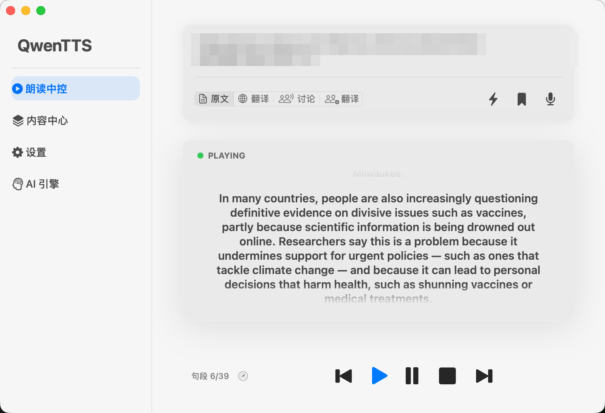
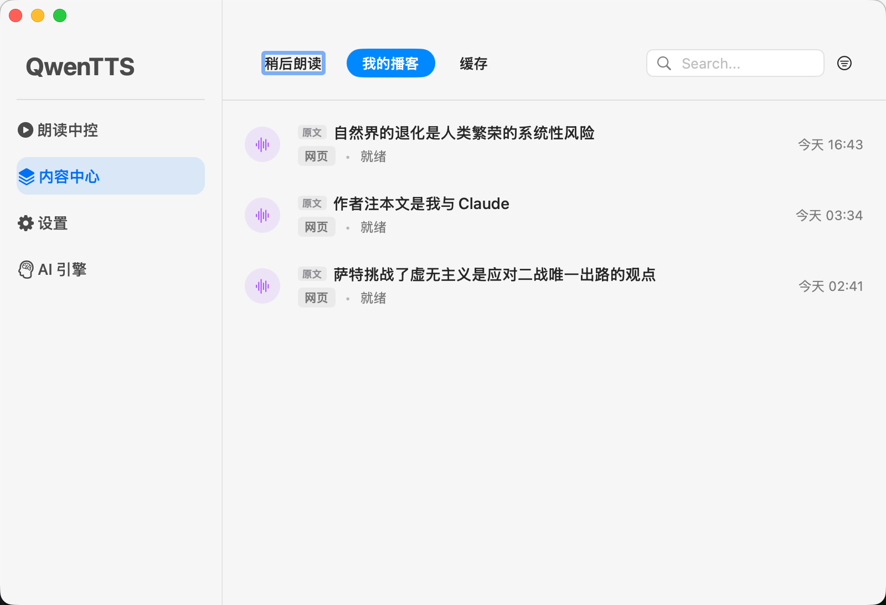
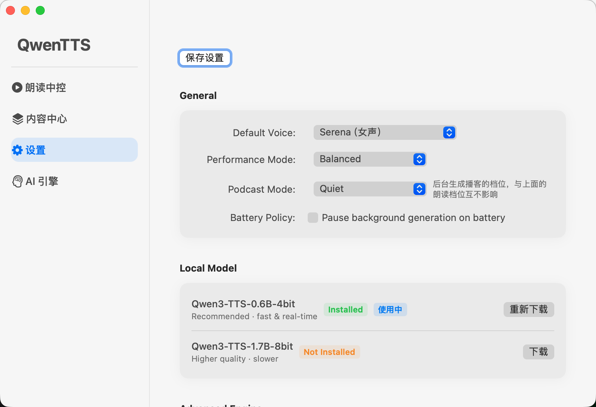

# QwenTTS macOS

QwenTTS is a local text-to-speech app for Apple Silicon Macs. It wraps Qwen3-TTS and MLX-Audio in a native macOS client, with support for reading pasted text, web pages, YouTube content, saved articles, generated podcasts, a built-in library, and menu bar playback.

TTS inference runs locally on your Mac. Your text does not need to be sent to a cloud TTS service.

[Download the latest DMG](https://github.com/hfl112/QwenTTS-macOS/releases) · Apple Silicon only · macOS 14+ · Local-first



## Features

- Runs Qwen3-TTS locally on Apple Silicon with MLX.
- Reads pasted text, long articles, web pages, and YouTube content.
- Supports original, translation, discussion, and two-speaker translation modes.
- Saves articles for later listening in the built-in library.
- Generates single-speaker audio or two-speaker podcast-style conversations.
- Provides native macOS playback controls from the main window and menu bar.
- Manages local models, existing model folders, performance mode, and battery policy.
- Works with a companion Chrome/Edge extension for browser-to-local reading.

## Screenshots

### Save Articles And Manage Podcasts



### Manage Local Models



## Requirements

- Apple Silicon Mac, M1 or newer.
- macOS 14.0 Sonoma or newer.
- About 6 GB of disk space, including the app and model weights downloaded on first launch.
- 16 GB memory or more is recommended.
- Intel Macs are not supported.
- The web/YouTube reader needs [Node.js](https://nodejs.org) and the
  [defuddle](https://github.com/kepano/defuddle) CLI (turns fetched pages into clean
  article text). One-time install:

  ```bash
  brew install node && npm install -g defuddle
  ```

  Everything else (read-aloud, saved items, podcasts) works without it.

## Installation

1. Open [Releases](https://github.com/hfl112/QwenTTS-macOS/releases) and download the latest `QwenTTS.dmg`.
2. Open the DMG and drag `QwenTTS.app` into your `Applications` folder.
3. If macOS blocks the app because it is not notarized, run:

   ```bash
   xattr -cr /Applications/QwenTTS.app
   ```

   You can also allow it from System Settings > Privacy & Security.

4. Launch `QwenTTS.app`. The app runs from the macOS menu bar and opens the main window.

## Local Models

Model weights are not bundled in the DMG. On first launch, QwenTTS checks the local environment and guides you through model setup. You can also manage models later from the Local Model section in Settings.

Recommended models:

- `Qwen3-TTS-0.6B-4bit`: recommended default, fast enough for real-time reading on common Apple Silicon Macs.
- `Qwen3-TTS-1.7B-8bit`: higher quality but slower, better suited for offline generation or longer podcast-style audio.

Models are stored by default at:

```text
~/Library/Application Support/QwenTTS/Models/
```

If you already have a model downloaded elsewhere, you can select the existing model directory from the setup wizard or settings page.

Model weights are downloaded from community quantized releases on Hugging Face, such as [mlx-community/Qwen3-TTS-12Hz-0.6B-Base-4bit](https://huggingface.co/mlx-community/Qwen3-TTS-12Hz-0.6B-Base-4bit). Model weights are not owned by this project and are not distributed in this repository. Please follow the license terms listed on each upstream model card.

## Browser Extension

QwenTTS can work with a companion Chrome/Edge extension to read web content. The app uses a pairing token so arbitrary web pages cannot call the local API directly.

1. Open QwenTTS Settings.
2. Generate an extension pairing token.
3. Save settings.
4. Install the companion `qwen-tts-extension` in Chrome or Edge.
5. Paste the pairing token into the extension settings.

After pairing, browser content can be sent to the local QwenTTS app for reading or podcast generation.

## Privacy

QwenTTS runs TTS inference locally on your Mac. Reading text is not sent to a cloud TTS service.

Some URL processing, translation, summarization, or discussion modes may use third-party LLM or translation providers if you configure them in the AI Engine settings. Plain local reading still works without enabling those providers.

Diagnostic exports are designed not to include saved article text, podcast job text, or other user content by default.

## Runtime Files

QwenTTS stores configuration, models, and generated files under Application Support:

- Configuration data: `~/Library/Application Support/QwenTTS/Data/`
- Local models: `~/Library/Application Support/QwenTTS/Models/`
- Generated podcasts: `~/Library/Application Support/QwenTTS/Podcasts/`
- Temporary cache: `~/Library/Application Support/QwenTTS/Cache/`
- Diagnostic logs: `~/Library/Application Support/QwenTTS/Logs/`

## Build From Source

Building the release DMG requires:

- Full Xcode, not only Command Line Tools.
- [`uv`](https://github.com/astral-sh/uv).
- [`xcodegen`](https://github.com/yonaskolb/XcodeGen), needed after changing `project.yml`.
- A statically linked arm64 `ffmpeg`, provided with `TTS_FFMPEG_PATH`. The packaging script rejects Homebrew's dynamically linked build.

Build commands:

```bash
python package_release.py
python run_diagnostics.py dist/QwenTTS.app
```

By default, the app uses ad-hoc signing and does not require an Apple Developer certificate. If you have a Developer ID identity, set `TTS_SIGNING_IDENTITY` for formal signing and use `notarize_dmg.py` for notarization.

## License

- This project is released under the MIT License. See [LICENSE](LICENSE).
- The bundled [MLX-Audio](https://github.com/Blaizzy/mlx-audio) snapshot is MIT licensed. See `backend/mlx_audio/LICENSE`.
- Reference audio under `backend/reference/` is AI-generated. See `backend/reference/README.md`.
- Model weight licenses are defined by the corresponding Hugging Face model cards.

